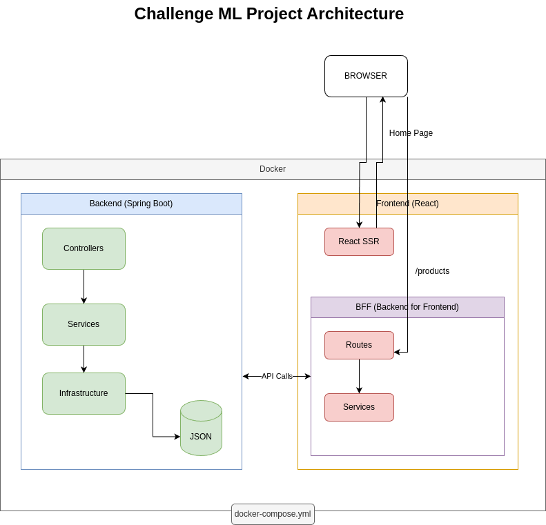

# 🚀 Challenge ML - Proyecto Completo

## 📋 Índice del Proyecto

Este README sirve como índice central para navegar por toda la documentación y recursos del proyecto **Challenge ML**.

---

## 🏗️ **Arquitectura del Proyecto**

### 📊 Diagrama de Arquitectura


**Descripción**: Diagrama completo que muestra la arquitectura del proyecto, incluyendo:
- Frontend React SSR con TypeScript + BFF Express.js como intermediario
- Backend Spring Boot con Java
- Flujo entre los componentes

---

## 📚 **Documentación Técnica**

### 🔧 **API Documentation**
- **Ubicación**: `backend/docs/swagger.yaml`
- **Descripción**: Documentación completa de la API REST con OpenAPI 3.0.3
- **Contenido**:
  - Endpoints disponibles
  - Esquemas de datos
  - Ejemplos de respuestas
  - Códigos de error
  - Especificaciones técnicas

### 🚀 **Guía de Ejecución**
- **Ubicación**: `RUN.md`
- **Descripción**: Instrucciones detalladas para levantar el proyecto
- **Contenido**:
  - Opción 1: Docker Compose (recomendado)
  - Opción 2: Desarrollo local
  - Endpoints del BFF

---

## 🛠️ **Estructura del Proyecto**

```
challenge-ml/
├── 📁 backend/                 # Backend Spring Boot
│   ├── 📁 src/main/java/      # Código fuente Java
│   ├── 📁 docs/               # Documentación API
│   └── 📄 build.gradle        # Configuración Gradle
├── 📁 frontend/               # Frontend React + BFF
│   ├── 📁 src/                # Código fuente
│   │   ├── 📁 web/           # Componentes React
│   │   └── 📁 bff/           # Backend for Frontend
│   ├── 📄 package.json       # Dependencias Node.js
│   └── 📄 env.example        # Variables de entorno
├── 📄 docker-compose.yml     # Configuración Docker
├── 📄 diagrama.drawio.png    # Diagrama de arquitectura
├── 📄 RUN.md                 # Guía de ejecución
└── 📄 README.md              # Este archivo
```

---

## 🎯 **Funcionalidades Principales**

### 📱 **Frontend (React + TypeScript)**
- **Página Home**: Listado de productos con información básica
- **Página Detail**: Detalle completo de productos
- **Componentes Reutilizables**: Header, ProductCard, ProductGallery, etc.
- **Responsive Design**: Interfaz adaptativa

### ⚡ **BFF (Backend for Frontend)**
- **Express.js**: Servidor intermediario
- **Rutas API**: `/api/products/search` y `/api/products/:id`
- **Manejo de Errores**: Propagación de errores del backend
- **Variables de Entorno**: Configuración flexible

### ☕ **Backend (Spring Boot)**
- **Java 17**: Lenguaje de programación
- **Spring Boot 3.5.3**: Framework
- **Almacenamiento JSON**: Datos locales en `products.json`
- **API RESTful**: Endpoints documentados con Swagger

---

## 🚀 **Inicio Rápido**

### Opción 1: Docker Compose (Recomendado)
```bash
# Clonar el repositorio
git clone <repository-url>
cd challenge-ml

# Ejecutar con Docker
docker-compose up --build

# Acceder a la aplicación
# Frontend: http://localhost:3000
```

### Opción 2: Desarrollo Local
```bash
# Backend
cd backend
./gradlew bootRun

# Frontend (en otra terminal)
cd frontend
cp env.example .env
npm install
npm run start
```

---

## 🔧 **Configuración**

### Variables de Entorno
- **Ubicación**: `frontend/env.example`
- **Variables principales**:
  - `PORT`: Puerto del servidor BFF (default: 3000)
  - `API_CORE_URL`: URL del backend (default: http://localhost:8080)

### Docker Compose
- **Puertos**:
  - Frontend: 3000
  - Backend: 8080 (interno)
- **Red**: `app-network` para comunicación entre servicios

---

## 📖 **Endpoints Disponibles**

### BFF Endpoints
- `GET /api/products/search` - Listado de productos
- `GET /api/products/:id` - Detalle de producto específico

### Backend Endpoints
- `GET /api-core/products/search` - Listado de productos (API Core)
- `GET /api-core/products/:id` - Detalle de producto (API Core)

---

## 🧪 **Testing**

### Backend Tests
- **Ubicación**: `backend/src/test/`
- **Frameworks**: JUnit 5, Spring Boot Test
- **Cobertura**: Controllers, Services, Repositories

### Frontend Tests
- **Componentes**: Testing de componentes React
- **Integración**: Testing de flujos completos

---

## 📦 **Tecnologías Utilizadas**

### Frontend Stack
- ⚛️ **React 18** - Biblioteca de UI
- 📘 **TypeScript** - Tipado estático
- 🎨 **CSS Modules** - Estilos modulares
- ⚡ **Express.js** - BFF Server

### Backend Stack
- ☕ **Java 17** - Lenguaje de programación
- 🌱 **Spring Boot 3.5.3** - Framework
- 📦 **Gradle** - Build tool
- 📄 **JSON** - Almacenamiento de datos

### DevOps
- 🐳 **Docker** - Contenedores
- 🐳 **Docker Compose** - Orquestación
- 🔧 **dotenv** - Variables de entorno

---

## 📝 **Documentación Adicional**

### Archivos Importantes
- `backend/docs/swagger.yaml` - Documentación API completa
- `RUN.md` - Guía de ejecución detallada
- `diagrama.drawio.png` - Diagrama de arquitectura
- `docker-compose.yml` - Configuración de contenedores

---

## 👥 **Autor**

- **Desarrollador** - [Edgardo Turrin](https://github.com/edgarturrin)
